# CEPARCO Integrating Project

## Overview
This project focuses on optimizing the ViBE background subtraction algorithm using SIMD (Single Instruction, Multiple Data) parallelization with AVX/AVX2 instructions. The implementation is designed for processing CCTV or stationary camera footage in real-time, providing an efficient method for background subtraction on devices lacking GPU acceleration.

To ensure correctness and efficiency, a non-parallelized C/C++ benchmark implementation is provided for verification. Parallelized ViBE was also conducted against OpenCV's Gaussian Mixture Model algorithm, parallelized through threads. 
## Project Structure
### (1) PARCO Integrating Project parallel
- contains the parallelized ViBE algorithm utilizing SIMD operations.
- optimized for AVX/AVX2 instructions to accelerate Euclidean distance computations.
- processes video frames in parallel for real-time background subtraction.
### (2) PARCO Integrating Project real
- contains the basic, non-parallelized C implementation of the ViBE algorithm.
- serves as a benchmark for correctness verification and performance comparison.
### (3) GMM
- implements the Gaussian Mixture Model (GMM) for background subtraction.
- utilizes multithreading to parallelize computations across multiple CPU cores.
- designed to compare performance against the optimized ViBE algorithm.
- comparing the GMM is just for curiousity purposes

## How to Run the Project
- download ffmpeg through: https://ffmpeg.org/download.html
- the guide on how to download ffmpeg can be found here: https://phoenixnap.com/kb/ffmpeg-windows
- open the Visual Studio solution provided in the repository.
- run the appropriate project (PARCO Integrating Project parallel for the SIMD implementation, or PARCO Integrating Project real for the basic implementation).
- the output video will be generated in the corresponding folder: PARCO Integrating Project parallel/PARCO Integrating Project parallel or PARCO Integrating Project real/PARCO Integrating Project real
- the default output video is set to 5 FPS for efficiency, as higher FPS requires more processing time.
- if the input video titled "short.mp4" cant be loaded because it's too large for git, here's an alternative link to copy paste into the folders mentioned above: https://drive.google.com/drive/folders/1gzh8Kjfhrz5VFJ5lVa8d7atMygARJhzE?usp=sharing
- to run GMM code, you need OpenCV.
  - Tutorial (can just watch the installation part): https://youtu.be/2FYm3GOonhk?t=262
  - Download OpenCV: https://github.com/opencv/opencv/releases

## Parallelization Approach
### (1) Original ViBE Algorithm (without AVX)
In the original, sequential ViBE algorithm:
- Each pixel in the current image is compared with the corresponding pixel in the history image.
- If the difference between the pixel values exceeds a predefined threshold, the pixel is marked for further processing.
- The segmentation map is updated based on the threshold check, one pixel at a time.
  
This is done in the following steps: 

(1) First History Image Processing and (2) Next History Image Processing 

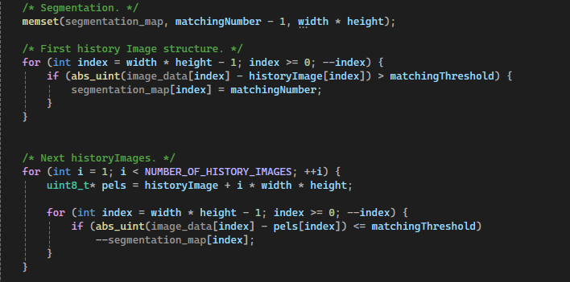

(3) Output Mask

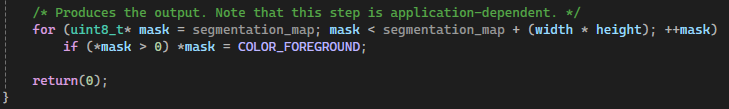

This approach processes pixels individually, which becomes inefficient for large images due to the lack of parallelism.

### (2) Parallelized ViBE Algorithm (with AVX)
Instead of processing each pixel sequentially, we now leverage AVX registers to process 32 pixels simultaneously. The key optimizations include:
- Vectorized Loading: We load 32 pixels into a 256-bit AVX register at once.
- Broadcast Threshold: The threshold value is broadcast to all 32 positions in the register.
- Vectorized Subtraction: The absolute differences between the current and history image pixels are calculated using SIMD instructions.
- Threshold Comparison: Each comparison is done for 32 pixels in a single instruction.
- Segmentation Update: The segmentation map is updated in parallel, modifying 32 pixels at once.

(1) First History Image Processing and (2) Next History Image Processing (Function Call)

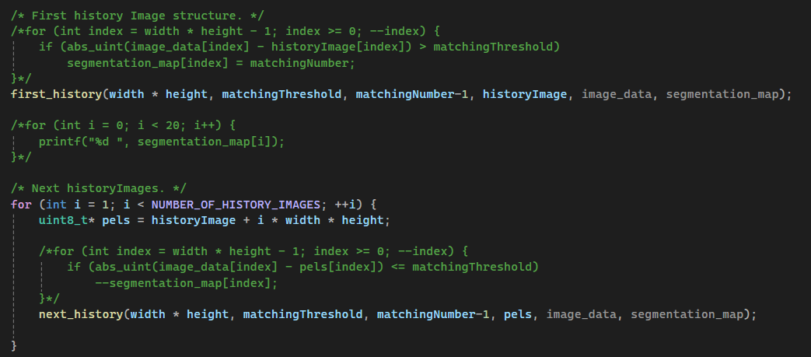

(3) Output Mask (Function Call)

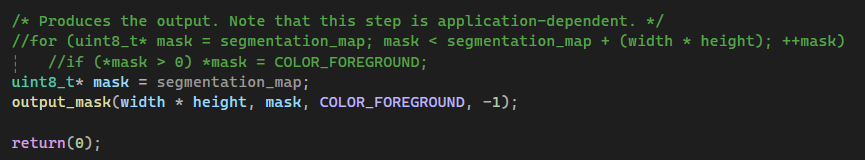

First History Image Processing (AVX-Optimized):

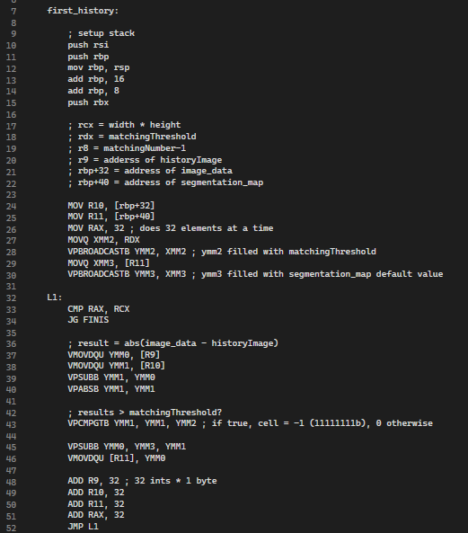

Next History Image Processing (AVX-Optimized):

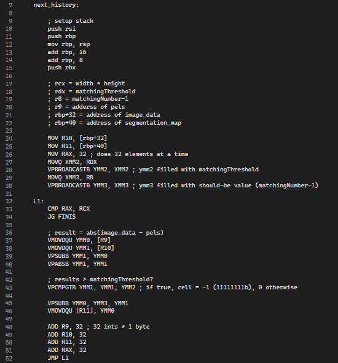

Output Mask (AVX-Optimized):

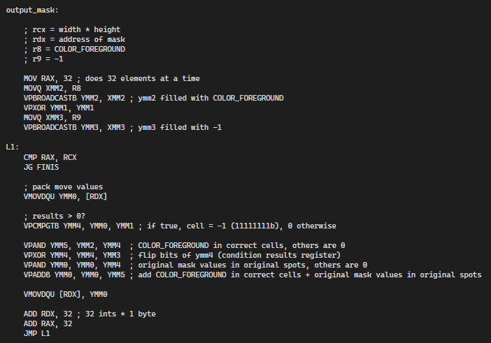

By processing 32 pixels per instruction cycle, we reduce the number of operations and speed up the algorithm significantly, especially for large images.

## Execution Screenshots
The table below shows the execution time of the ViBE algorithm (Non-Parallelized and Parallelized) - Debug mode:
|          ViBE (Non-Parallelized)          |          ViBE (Parallelized)              |
| ----------------------------------------- | ----------------------------------------- |
|  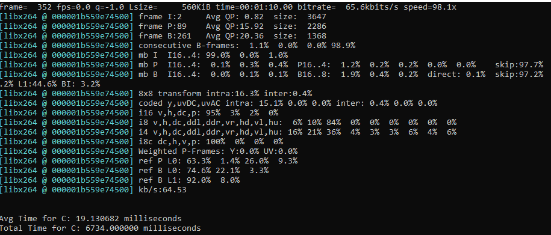     | 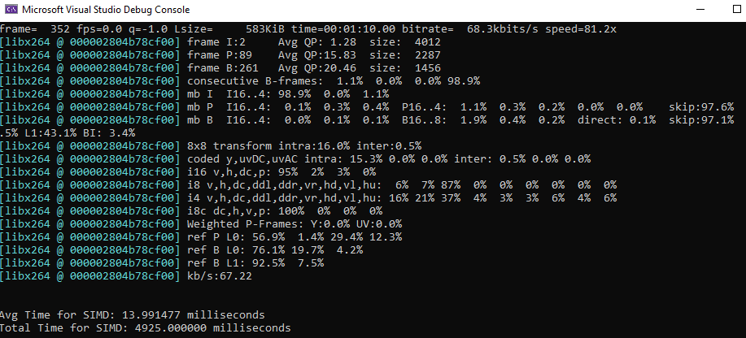  |

The table below shows the execution time of the ViBE algorithm (Non-Parallelized and Parallelized) - Release mode:
|          ViBE (Non-Parallelized)          |          ViBE (Parallelized)              |
| ----------------------------------------- | ----------------------------------------- |
|  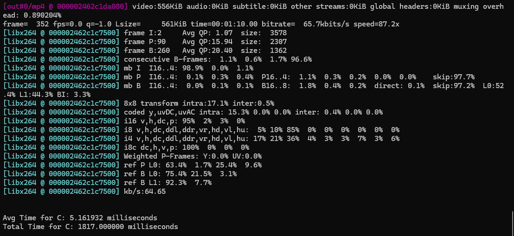     | 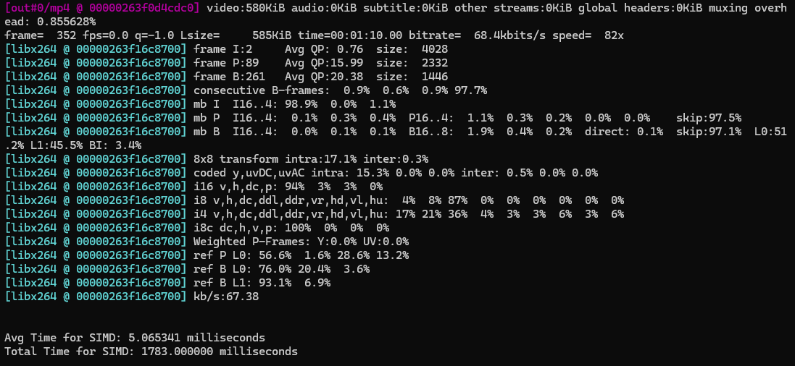  |

The table below shows the execution time of the SIMD and GMM: 
|      ViBE (Non-Parallelized, 30FPS)        |      ViBE (Parallelized, 30FPS)           |                  GMM                      |
| -----------------------------------------  | ----------------------------------------- | ----------------------------------------- |
| 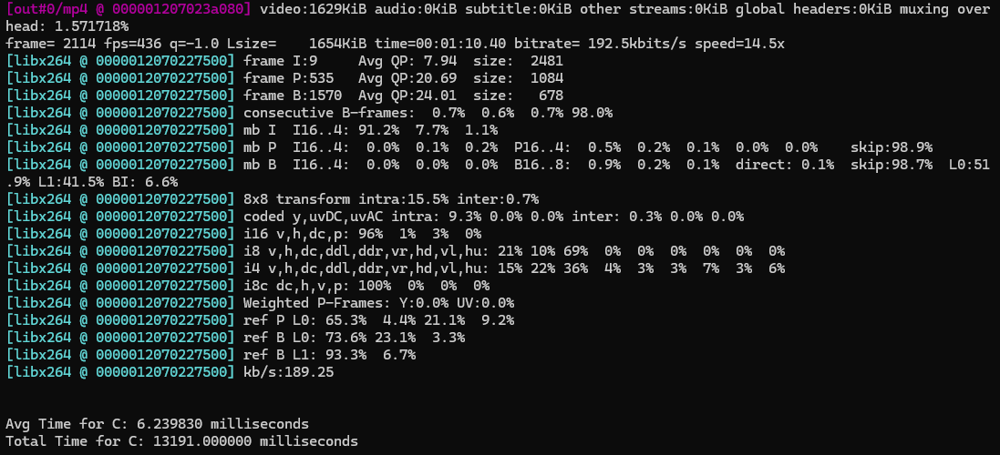   |  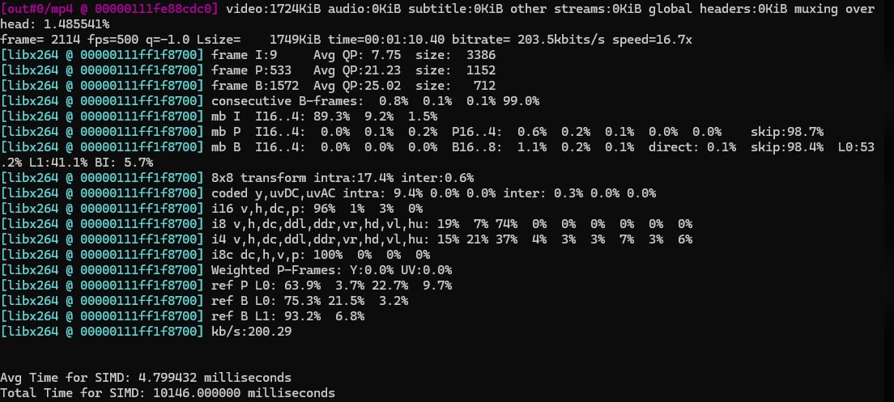     | 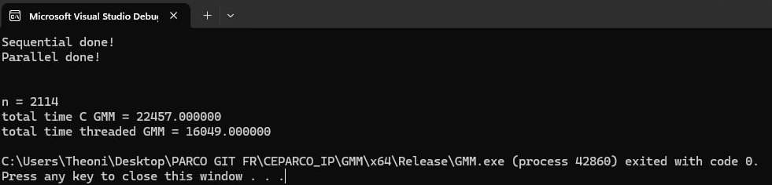       |

## Performance Comparison
Debug mode - ViBE Algorithm Performance (at 5 FPS):
| Implementation                  |     ViBE (Non-Parallelized) |   ViBE (Parallelized)     | 
|---------------------------------|-----------------------------|---------------------------|
| Average Execution Time (ms)     |          19.130682          |   13.991477               |  
| Total Execution Time (ms)       |            6734.000000      |     4925.000000           | 

Release mode - ViBE Algorithm Performance (at 5 FPS):
| Implementation                  |     ViBE (Non-Parallelized) |   ViBE (Parallelized)     | 
|---------------------------------|-----------------------------|---------------------------|
| Average Execution Time (ms)     |          5.161932           |       5.065341            |  
| Total Execution Time (ms)       |          1817.000000        |      1783.000000          | 

Release mode - ViBE Algorithm (at 30 FPS) vs GMM:
|                                 | ViBE (Non-Parallelized)    | ViBE (Parallelized, 30FPS) |           GMM           | 
|---------------------------------|----------------------------|----------------------------|-------------------------|
|  Average Execution Time (ms)    |        6.239830            |          4.799432          |                         | 
|  Total Execution Time (ms)      |        13191.000000        |       10146.000000         |                         | 
|  Total Time C GMM (ms)          |                            |                            |     22457.000000        | 
|  Total Time Threaded GMM (ms)   |                            |                            |     16049.000000        | 

## Peformance Analysis
# Debug mode - ViBE Algorithm Performance (at 5 FPS):
| Implementation                                         | Speedup Ratio |
|--------------------------------------------------------|---------------|
| ViBE (Non-Parallelized)  vs.   ViBE (Parallelized)     | 1.367309899   | 

- The ViBE (Parallelized) is 1.37x faster than ViBE (Non-Parallelized) in Debug mode. 
- The performance boost is mainly due to SIMD optimizations, though Debug Mode overhead (such as additional runtime checks) still affects execution.
- By handling 32 pixels per instruction cycle, the algorithm reduces computational workload, significantly improving efficiency—especially for processing large images.

# Release mode - ViBE Algorithm Performance (at 5 FPS):
| Implementation                                         | Speedup Ratio |
|--------------------------------------------------------|---------------|
| ViBE (Non-Parallelized)  vs.   ViBE (Parallelized)     | 1.019069002   |

- The ViBE (Parallelized) is 1.02x faster than ViBE (Non-Parallelized) in Debug mode.
- In Release Mode, both versions execute much faster compared to Debug Mode, with an overall reduction in execution time.
- However, the performance difference between Parallelized and Non-Parallelized ViBE is minimal, indicating that compiler optimizations already improve efficiency.
- At lower FPS settings, the impact of parallelization is less pronounced.

# Release mode - ViBE Algorithm (at 30 FPS) vs GMM:
| Implementation                                         | Speedup Ratio |
|--------------------------------------------------------|---------------|
| ViBE (Non-Parallelized)  vs.  ViBE (Parallelized)      | 1.300118431   |
| ViBE (Non-Parallelized)  vs.  GMM (Non-Parallelized)   | 1.702448639   |
| ViBE (Parallelized)  vs.  GMM (Threaded)               | 1.581805638   |

- Parallelized ViBE is ~30% faster than the non-parallelized version, showing that SIMD optimizations effectively reduce execution time at a larger data set.
- Non-parallelized ViBE outperforms non-parallelized GMM by ~70%, indicating that ViBE is inherently more efficient for background subtraction in this implementation.
- Even when GMM is parallelized with threading, ViBE (Parallelized) is still ~58% faster, suggesting that SIMD optimizations provide a greater speed boost compared to thread-based parallelization alone.
- The results demonstrate that SIMD-based ViBE is more suitable for real-time background subtraction at 30 FPS, as it achieves lower execution times than both versions of GMM.

## Video Presentation

